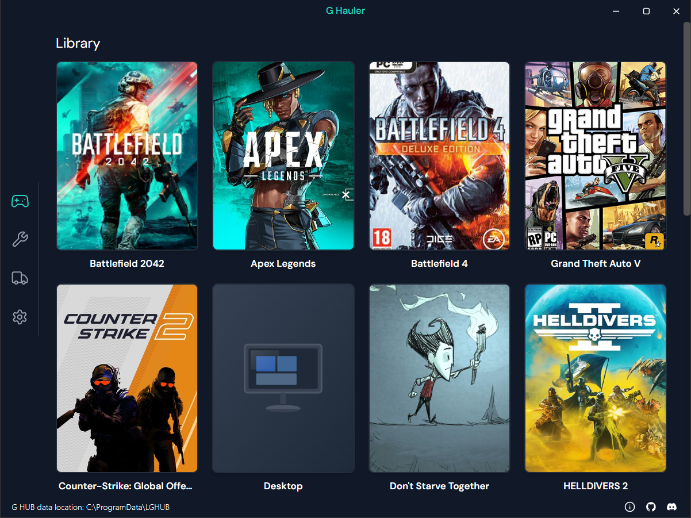
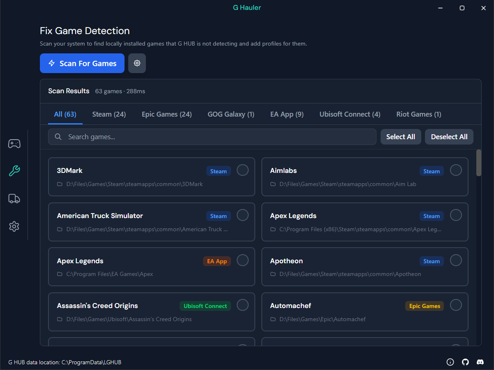

# G Hauler

<div align="center">
  
  
</div>

A fast, lightweight, and secure desktop app for managing Logitech G HUB profiles and fixing game detection issues.

## Development

The app is currently on Tauri v2.

### System requirements

Follow the Tauri [prerequisites guide](https://v2.tauri.app/start/prerequisites/) for your operating system.

Make sure Rust and Node are installed.

### Dependencies

The project uses [pnpm](https://pnpm.io/installation).

Install dependencies with

```shell
pnpm install
```

### Development

Run the app in development mode with

```shell
pnpm tauri dev
```

## Recommended IDE Setup

[VS Code](https://code.visualstudio.com/) + [Svelte](https://marketplace.visualstudio.com/items?itemName=svelte.svelte-vscode) + [Tauri](https://marketplace.visualstudio.com/items?itemName=tauri-apps.tauri-vscode) + [rust-analyzer](https://marketplace.visualstudio.com/items?itemName=rust-lang.rust-analyzer).
